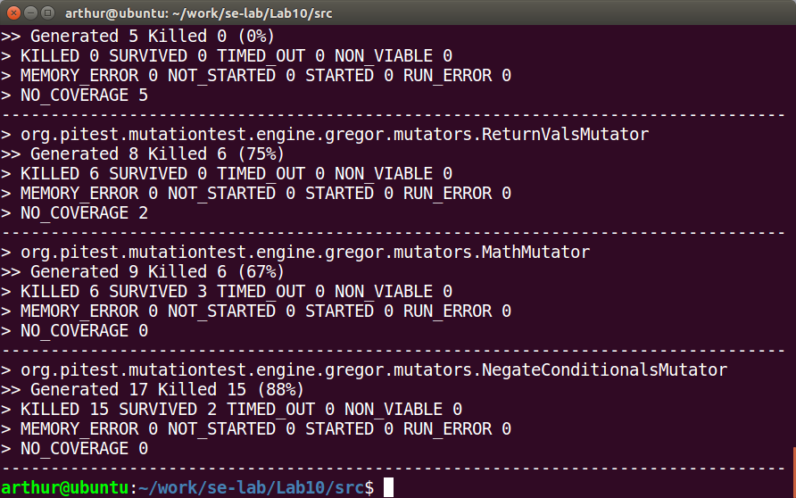
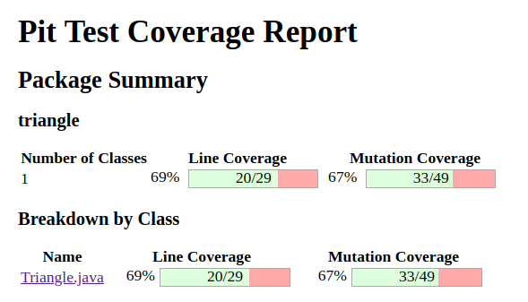

# Lab10 report

11510352 李子强

## Folder hierarchy
```
.
├── 201805221711
│   ├── index.html
│   ├── style.css
│   └── triangle
│       ├── index.html
│       └── Triangle.java.html
├── hamcrest-core-1.3.jar
├── junit-4.12.jar
├── pitest-1.4.0.jar
├── pitest-command-line-1.4.0.jar
├── pitest-entry-1.4.0.jar
└── triangle
    ├── TestSuite.class
    ├── TestSuite.java
    ├── Triangle.class
    ├── Triangle.java
    └── Triangle$Type.class
```

## Shell commands
```bash
# Delete or comment test case 10, 11, 14, 20 in TestSuite.java

# Compile
javac -cp ".:./junit-4.12.jar:./hamcrest-core-1.3.jar:$CLASSPATH" triangle/Triangle.java triangle/TestSuite.java

# Generate PIT report
java -cp .:$CLASSPATH:junit-4.12.jar:pitest-command-line-1.4.0.jar:pitest-entry-1.4.0.jar:pitest-1.4.0.jar \
    org.pitest.mutationtest.commandline.MutationCoverageReport \
    --reportDir . \
    --targetClasses triangle.Triangle \
    --targetTests triangle.TestSuite \
    --sourceDirs triangle 
```

## Screenshot





## Result analysis

The test suite cover 20 lines in 29 lines. Generated 49 mutations Killed 33.

1. ConditionalsBoundaryMutator
> Generated 10 Killed 6 (60%)

2. VoidMethodCallMutator
> Generated 5 Killed 0 (0%)

3. ReturnValsMutator
> Generated 8 Killed 6 (75%)

4. MathMutator
> Generated 9 Killed 6 (67%)

5. NegateConditionalsMutator
> Generated 17 Killed 15 (88%)
