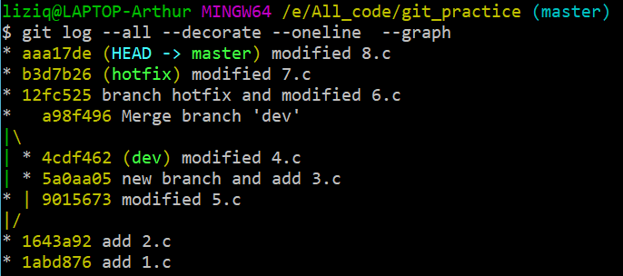

# Lab11 report

11510352 李子强

## Commands
```bash
git init

touch 1.c
git add .
git commit -m "add 1.c"

mv 1.c 2.c
git add .
git commit -m "add 2.c"

git checkout -b dev
mv 2.c 3.c
git add .
git commit -m "new branch and add 3.c"

mv 3.c 4.c
git add .
git commit -m "modified 4.c"

git checkout master 
mv 2.c 5.c
git add .
git commit -m "modified 5.c"

git checkout -b hotfix

git checkout master
git merge dev

git checkout hotfix
mv 5.c 6.c
git add .
git commit -m "branch hotfix and modified 6.c"

mv 6.c 7.c
git add .
git commit -m "modified 7.c"

git checkout master
git rebase --onto master master hotfix

git checkout master
git merge hotfix

mv 7.c 8.c
git add .
git commit -m "modified 8.c"

git log
git log --all --decorate --oneline  --graph 
```

## Log

```
commit aaa17def1676e6a384267cb203ea091f00aa1b9c
Author: lizi_wl <leezisy@gmail.com>
Date:   Mon May 28 20:28:29 2018 +0800

    modified 8.c

commit b3d7b26a75c370835a999490436282713c3f8b14
Author: lizi_wl <leezisy@gmail.com>
Date:   Mon May 28 20:26:46 2018 +0800

    modified 7.c

commit 12fc5250e72a2dd93f464434ac65f00b043ffe57
Author: lizi_wl <leezisy@gmail.com>
Date:   Mon May 28 20:26:43 2018 +0800

    branch hotfix and modified 6.c

commit a98f4961aabbe30cff63e31ea68be844631ede12
Merge: 9015673 4cdf462
Author: lizi_wl <leezisy@gmail.com>
Date:   Mon May 28 20:26:09 2018 +0800

    Merge branch 'dev'

commit 9015673f93f42d2f103cb0cccee937b63c2c9c65
Author: lizi_wl <leezisy@gmail.com>
Date:   Mon May 28 20:24:35 2018 +0800

    modified 5.c

commit 4cdf4620828110152d99b3b118f111e76b9a89d5
Author: lizi_wl <leezisy@gmail.com>
Date:   Mon May 28 20:24:33 2018 +0800

    modified 4.c

commit 5a0aa0566576299fe0f9de18a6bdd06eed1c5a43
Author: lizi_wl <leezisy@gmail.com>
Date:   Mon May 28 20:24:32 2018 +0800

    new branch and add 3.c

commit 1643a922261022310ae1f436eaea15089a984b72
Author: lizi_wl <leezisy@gmail.com>
Date:   Mon May 28 20:24:31 2018 +0800

    add 2.c

commit 1abd8769b2c06dbe03cbfc18c135ec3504e9547c
Author: lizi_wl <leezisy@gmail.com>
Date:   Mon May 28 20:24:31 2018 +0800

    add 1.c
```

## Screenshot



## Question
* how do you solve conflicts on second merge?

    Open the file and solve it manually.

