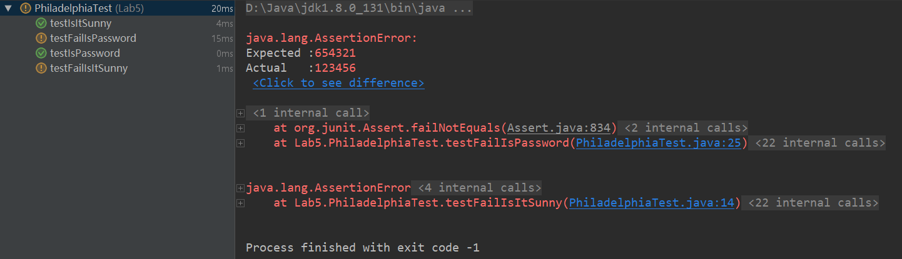
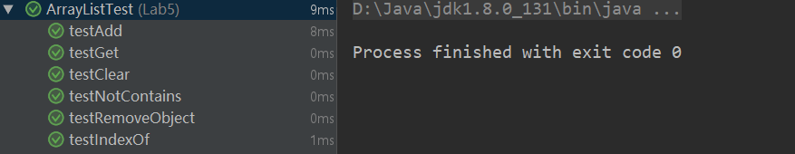
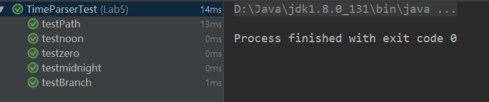
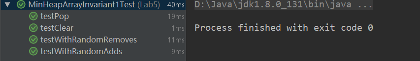

# Report Lab5
李子强 11510352

## Exercise1

* Add a test in which an assertion as the picture shows.
* Write a new test that throws an exception

## Exercise2

* 添加并测试 `clear`, `contains`, `get` 方法。

## Exercise3

* 测试 `parseTimeToSeconds` 方法。

## Exercise4

* 测试堆的边界条件：array[n] <= array[2*n+1] and array[n] <= array[2*n+2]

```java
private boolean invariantHolds() {
        Integer top = heap.peek();
        if (top == null) {
            return true;
        }
        Integer[] contents = new Integer[heap.size()];
        contents = heap.toArray(contents);
        for (int i = 0; i < (heap.size() - 1) / 2; i++) {
            if (contents[i] > contents[2 * i + 1] || contents[i] > contents[2 * i + 2]) {
                System.out.println("Whoops!");
                return false;
            }
        }
        return true;
    }
```