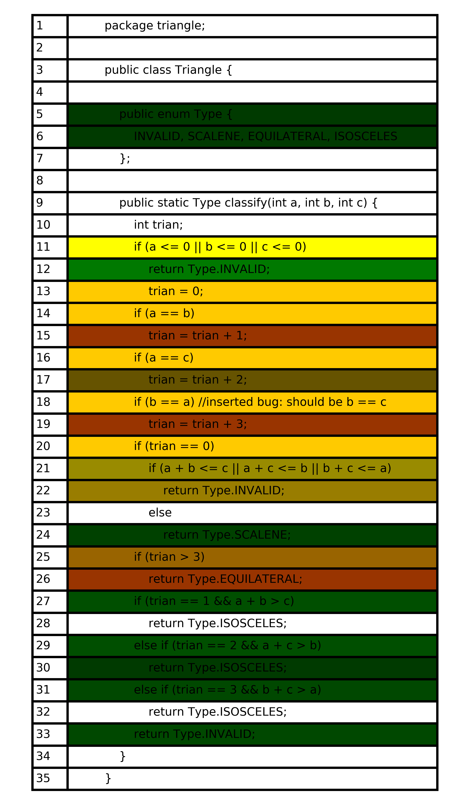

# Lab6 Report: Fault-localization

Name: Ziqiang LI

StudentNo: 11510352

## Ant output
```
Buildfile: /home/arthur/work/se/fault-localization/build.xml

init:

compile:
    [javac] Compiling 2 source files to /home/arthur/work/se/fault-localization/bin

run.tarantula:
     [java] For program: triangle/Triangle.java
     [java] line 3: ratio: -1.000000, brightness: -1.000000
     [java] line 4: ratio: -1.000000, brightness: -1.000000
     [java] line 5: ratio: 1.000000, brightness: 0.034483
     [java] line 6: ratio: 1.000000, brightness: 0.034483
     [java] line 7: ratio: -1.000000, brightness: -1.000000
     [java] line 8: ratio: -1.000000, brightness: -1.000000
     [java] line 9: ratio: -1.000000, brightness: -1.000000
     [java] line 10: ratio: -1.000000, brightness: -1.000000
     [java] line 11: ratio: 0.500000, brightness: 1.000000
     [java] line 12: ratio: 1.000000, brightness: 0.344828
     [java] line 13: ratio: 0.395833, brightness: 1.000000
     [java] line 14: ratio: 0.395833, brightness: 1.000000
     [java] line 15: ratio: 0.171429, brightness: 0.500000
     [java] line 16: ratio: 0.395833, brightness: 1.000000
     [java] line 17: ratio: 0.408163, brightness: 0.250000
     [java] line 18: ratio: 0.395833, brightness: 1.000000
     [java] line 19: ratio: 0.171429, brightness: 0.500000
     [java] line 20: ratio: 0.395833, brightness: 1.000000
     [java] line 21: ratio: 0.452830, brightness: 0.500000
     [java] line 22: ratio: 0.408163, brightness: 0.500000
     [java] line 23: ratio: -1.000000, brightness: -1.000000
     [java] line 24: ratio: 1.000000, brightness: 0.068966
     [java] line 25: ratio: 0.325581, brightness: 0.500000
     [java] line 26: ratio: 0.171429, brightness: 0.500000
     [java] line 27: ratio: 1.000000, brightness: 0.137931
     [java] line 28: ratio: -1.000000, brightness: -1.000000
     [java] line 29: ratio: 1.000000, brightness: 0.137931
     [java] line 30: ratio: 1.000000, brightness: 0.034483
     [java] line 31: ratio: 1.000000, brightness: 0.103448
     [java] line 32: ratio: -1.000000, brightness: -1.000000
     [java] line 33: ratio: 1.000000, brightness: 0.103448

BUILD SUCCESSFUL
Total time: 0 seconds
```

## Python visualization code
```python
import matplotlib.pyplot as plt
import re
import colorsys as cs


def get_rgb_color(ratio, bright):
    if ratio == -1 and bright == -1:
        return 'w'
    h = ratio / 3
    s = 1
    v = bright*4 / 5 + 1/5
    return cs.hsv_to_rgb(h, s, v)


def format_color(color, length):
    print(color)
    out = [['w', 'w'] for i in range(length)]
    for i in range(len(color)):
        out[color[i][0] - 1][1] = color[i][1]
    return out


pattern = re.compile(r'\[java\] line (\d+): ratio: (-?\d+\.\d*), brightness: (-?\d+\.\d*)')

color = []
with open('data.txt', 'r') as f:
    for line in f.readlines():
        line = line.strip()
        data = pattern.findall(line)
        if data:
            line_no, ratio, bright = pattern.findall(line)[0]
            color.append((int(line_no), get_rgb_color(float(ratio), float(bright))))

code = []
count = 1
with open('Triangle.java', 'r') as tri_f:
    for line in tri_f.readlines():
        code.append([count, line.strip('\n')])
        count += 1
color = format_color(color, len(code))
print(color)

fig, ax = plt.subplots()
# hide axes
fig.patch.set_visible(False)
ax.axis('off')
ax.axis('tight')

tb1 = ax.table(cellText=code[:], cellColours=color[:], cellLoc='left', loc='center')
tb1.auto_set_column_width(0)
tb1.scale(0.9, 0.8)

plt.savefig("fault.png", dpi=1000)
plt.show()
```

## Result

